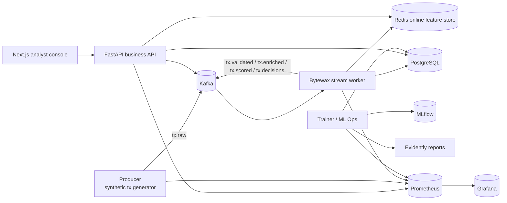

<div align="center">


<p>
  <a href="https://github.com/kulharshit21/bytewatch-fraud-platform"></a>
  <a href="https://github.com/kulharshit21/bytewatch-fraud-platform/commits/main"></a>
  
  
</p>

<p>
  
  
  
  
  
</p>

</div>

Production-minded fraud platform built as a modular monorepo with Kafka ingestion, a Bytewax stream worker, Redis online features, XGBoost plus rules hybrid scoring, FastAPI business APIs, PostgreSQL persistence, MLflow model registry, Evidently drift reporting, Grafana dashboards, and a real Next.js analyst console.

## Quick Jump

<p>
  <a href="#what-is-real-now"></a>
  <a href="#architecture"></a>
  <a href="#quickstart"></a>
  <a href="#live-demo-experience"></a>
  <a href="#known-limitations"></a>
</p>

## What Is Real Now

<table>
  <tr>
    <td width="50%" valign="top">
      <h3>Streaming and decisioning</h3>
      <ul>
        <li>Kafka topics are bootstrapped automatically for <code>tx.raw</code>, <code>tx.validated</code>, <code>tx.enriched</code>, <code>tx.scored</code>, <code>tx.decisions</code>, <code>tx.feedback</code>, and <code>tx.dlq</code>.</li>
        <li>The producer generates realistic synthetic transaction behavior and publishes directly to <code>tx.raw</code>.</li>
        <li>The stream worker consumes Kafka with Bytewax, validates events, computes Redis-backed online features, scores with rules plus model runtime, persists to PostgreSQL, and emits downstream topics.</li>
        <li>The overview page includes demo controls that trigger real producer behavior through API-backed control endpoints.</li>
      </ul>
    </td>
    <td width="50%" valign="top">
      <h3>Product and MLOps</h3>
      <ul>
        <li>The trainer can bootstrap a champion XGBoost model, register it in MLflow, and generate Evidently drift artifacts.</li>
        <li>The API exposes real fraud workflows: <code>/predict</code>, <code>/cases</code>, <code>/cases/{id}</code>, feedback submission, model metadata, analytics, and dashboard payloads.</li>
        <li>The analyst console reads live API data. There are no hardcoded queue rows or fake case cards left in the UI.</li>
        <li>Database retraining consumes analyst feedback from <code>analyst_feedback</code> by overriding synthetic labels with the latest analyst decision when available.</li>
      </ul>
    </td>
  </tr>
</table>

## Why The Repo Feels Live

<table>
  <tr>
    <td width="25%" valign="top">
      <strong>Live browser mode</strong><br />
      <sub><code>/overview</code> and <code>/cases</code> poll real FastAPI live endpoints, show last-updated labels, and surface real backend deltas.</sub>
    </td>
    <td width="25%" valign="top">
      <strong>Real analyst queue</strong><br />
      <sub>The backlog defaults to open <code>REVIEW</code> cases so the product flow matches the actual analyst workflow.</sub>
    </td>
    <td width="25%" valign="top">
      <strong>Real demo controls</strong><br />
      <sub>Burst, boost, pause, resume, and reset actions hit the producer service and move data through the real pipeline.</sub>
    </td>
    <td width="25%" valign="top">
      <strong>Real ops surface</strong><br />
      <sub>Grafana, Prometheus, MLflow, and Evidently are wired into the same monorepo instead of being slideware.</sub>
    </td>
  </tr>
</table>

## Architecture



More detail:

- [Architecture overview](docs/architecture/overview.md)
- [Transaction lifecycle](docs/architecture/transaction-lifecycle.md)
- [Runbook](docs/runbook.md)
- [Troubleshooting](docs/troubleshooting.md)
- [Demo script](docs/demo-script.md)

## Repository Layout

```text
apps/
  analyst-console/    # Next.js internal operations UI
  api/                # FastAPI business API
  producer/           # synthetic traffic generator + export CLI
  stream-worker/      # Bytewax flow + stream runtime
  trainer/            # XGBoost training, MLflow, Evidently
libs/
  common/             # config, logging, FastAPI service helpers
  contracts/          # shared Pydantic event contracts
  feature_engineering/# online/offline feature computation
  feature_store/      # Redis + in-memory feature store adapters
  model_runtime/      # champion model loading and hybrid scoring
  observability/      # Prometheus metrics
  persistence/        # SQLAlchemy models and repositories
  rules/              # YAML-driven fraud rules
infra/
  docker/             # Dockerfiles
  grafana/            # dashboards + alerts as code
  kafka/              # topic bootstrap
  postgres/           # init SQL + Alembic migrations
  prometheus/
docs/
tests/
```

## Core Runtime Flow

1. The producer emits realistic transaction events to `tx.raw`.
2. Bytewax consumes `tx.raw`.
3. The worker validates payloads and normalizes fields.
4. Redis provides hot account, device, and merchant context for rolling features.
5. The rule engine plus champion XGBoost model produce a final score and decision.
6. The worker persists raw, scored, and decision records to PostgreSQL.
7. FastAPI exposes cases, transactions, model metadata, analytics, and feedback endpoints.
8. The analyst console renders overview, queue, case detail, models, and monitoring pages from the real API.
9. In live mode, the console refreshes overview and backlog data every few seconds from dedicated live endpoints.
10. Analyst feedback is written to PostgreSQL, published to `tx.feedback`, and stored for retraining.
11. The trainer can retrain and refresh MLflow plus Evidently artifacts from generated CSV data or persisted database rows, with analyst feedback taking precedence over synthetic labels.

## Quickstart

### Prerequisites

- Docker Desktop or Docker Engine with Compose
- Node 20+ only if you want to run the analyst console outside Docker
- Python 3.11 for local non-Docker backend development

### One-command local stack

```bash
docker compose up --build
```

The stack includes:

- `kafka`
- `redis`
- `postgres`
- `prometheus`
- `grafana`
- `mlflow`
- `db-migrate`
- `model-bootstrap`
- `producer`
- `stream-worker`
- `api`
- `trainer`
- `analyst-console`

### Clean bootstrap from empty state

Use this when you want a deterministic local reset instead of reusing old Kafka, Redis, PostgreSQL, MLflow, or Grafana state.

```bash
make reset-stack
make bootstrap
```

Equivalent Docker Compose sequence:

```bash
docker compose down --volumes --remove-orphans
docker compose up -d --build
```

### Local URLs

| Surface | URL |
|---|---|
| Analyst console | `http://localhost:3001` |
| Overview live demo | `http://localhost:3001/overview` |
| Analyst backlog live demo | `http://localhost:3001/cases` |
| API docs | `http://localhost:8000/docs` |
| Producer | `http://localhost:8001/producer/status` |
| Stream worker | `http://localhost:8002/worker/status` |
| Trainer | `http://localhost:8003/training/status` |
| Grafana | `http://localhost:3000` |
| Prometheus | `http://localhost:9090` |
| MLflow | `http://localhost:5000` |

## Live Demo Experience

### What updates automatically

- `Overview` and `Cases` enable live mode by default.
- Live mode uses real short polling against FastAPI endpoints:
  - `/dashboard/live`
  - `/cases/live`
- Turning live mode off freezes the current browser snapshot until you click refresh.
- The backlog page defaults to the real analyst queue: `decision=REVIEW` and `status=open`.
- Demo controls on Overview call API-backed producer endpoints:
  - `POST /demo/producer/start`
  - `POST /demo/producer/stop`
  - `POST /demo/producer/burst`
  - `POST /demo/producer/boost`
  - `POST /demo/producer/reset`

### Fastest 60-second showcase

1. Open `http://localhost:3001/overview`.
2. Leave live mode on and watch the last-updated badge tick.
3. Fire a fraud burst from the demo controls panel.
4. Open `http://localhost:3001/cases` and show new `REVIEW` and `BLOCK` rows rising in the real analyst backlog.
5. Pivot into a case detail page, then out to Grafana for the operator story.

## Useful Commands

```bash
docker compose up --build
make reset-stack
make bootstrap
docker compose logs -f stream-worker
docker compose logs -f api
docker compose exec trainer fraud-trainer-cli bootstrap-model --force
docker compose exec trainer python -c "from fraud_platform_common.config import RuntimeSettings; from fraud_platform_persistence import FraudRepository; repo = FraudRepository(RuntimeSettings(service_name='trainer')); rows = repo.training_frame(); print(rows[-1]['label_source'], rows[-1]['latest_feedback_label'])"
docker compose exec trainer fraud-trainer-cli drift-report --sample-size 500
docker compose exec producer fraud-producer-cli export-dataset --output /data/bootstrap_transactions.csv --events 3000
docker compose exec api python -c "import requests; print(requests.get('http://localhost:8000/dashboard/overview').json())"
curl http://localhost:8000/dashboard/live
curl "http://localhost:8000/cases/live?status=open&decision=REVIEW"
curl -X POST http://localhost:8000/demo/producer/burst -H "content-type: application/json" -d "{\"scenario\":\"impossible_travel\",\"count\":10}"
make test-docker
make frontend-test
```

## Local Development

### Python

```bash
python -m compileall apps libs
pytest
```

Important: this repo targets Python 3.11. Running tests with Python 3.10 will fail because the code intentionally uses Python 3.11 features such as `StrEnum` and `datetime.UTC`.

Reproducible backend test run from Docker:

```bash
make test-docker
```

### Analyst console

```bash
cd apps/analyst-console
npm install
npm run build
npm test
```

## Testing Status

Automated coverage includes:

- contract schema tests
- synthetic producer tests
- in-memory feature store tests
- rule engine tests
- model runtime tests
- stream processor behavior tests
- trainer feature-frame and threshold tests
- API business endpoint tests
- repository feedback-to-training frame tests
- analyst console render, API helper, and server-action tests

Recommended verification commands:

```bash
make test-docker
make frontend-test
```

## Observability

- Prometheus metrics are exposed by every Python service on `/metrics`.
- Grafana dashboards are provisioned from `infra/grafana/dashboards`.
- Alert rules are provisioned from `infra/grafana/provisioning/alerting`.
- Local development routes firing alerts to the API webhook sink at `/ops/grafana-alerts` instead of external email or chat systems.
- Drift gauges are updated from trainer-side Evidently report generation.

## Known Limitations

- The worker runtime runs Bytewax inside the service process for local simplicity; distributed deployment tuning is still out of scope for this repo.
- The current MLflow service uses a local SQLite-backed metadata store suitable for local demos, not HA production.
- Feedback-driven retraining is implemented as a controlled and manual workflow, not automatic promotion.
- Local Grafana notifications terminate at the API webhook sink rather than a real on-call channel.
- Kafka lag monitoring is not fully instrumented yet.
- The `Models` page remains snapshot-style; the live polling emphasis is on `Overview` and `Cases`, where demo value is highest.
- The local host shell still defaults to Python 3.10, so backend commands should be run through Docker or Python 3.11 even though the platform itself has been runtime-verified in Docker.

## Why This Project Is Defensible

- real streaming path instead of notebook-only fraud scoring
- Redis online features rather than fake precomputed aggregates
- hybrid rules plus model decisioning with persisted explanation artifacts
- analyst feedback loop with DB persistence and Kafka event emission
- model registry and drift reporting included in the same repo
- dashboards, alerts, migrations, health checks, and service boundaries are version-controlled

<div align="center">


</div>
