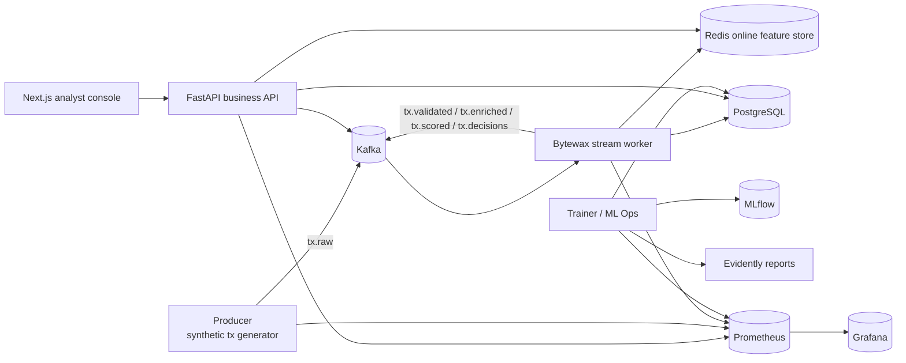
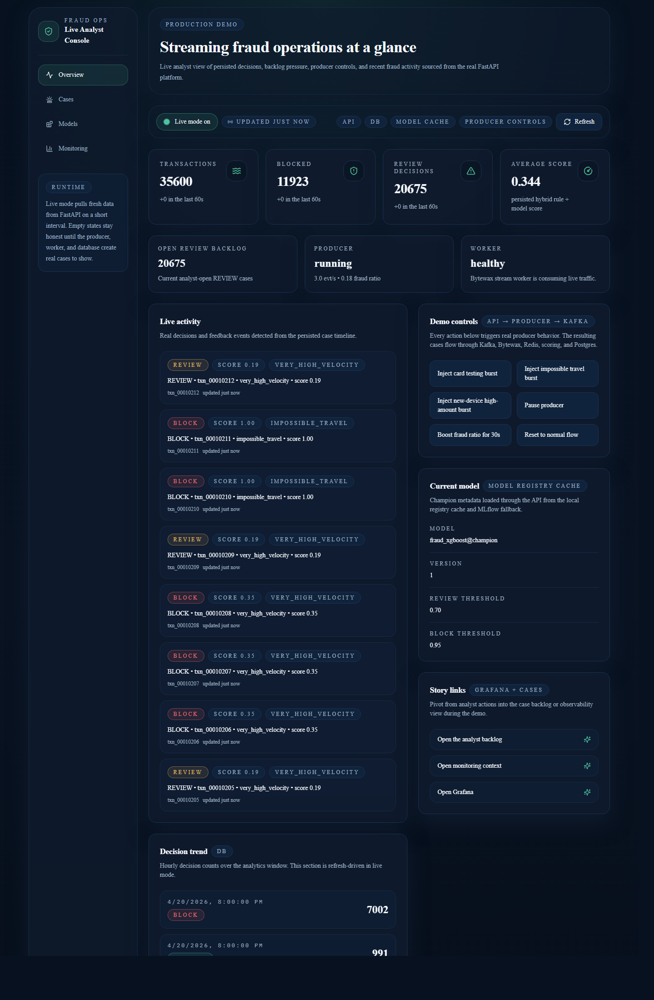
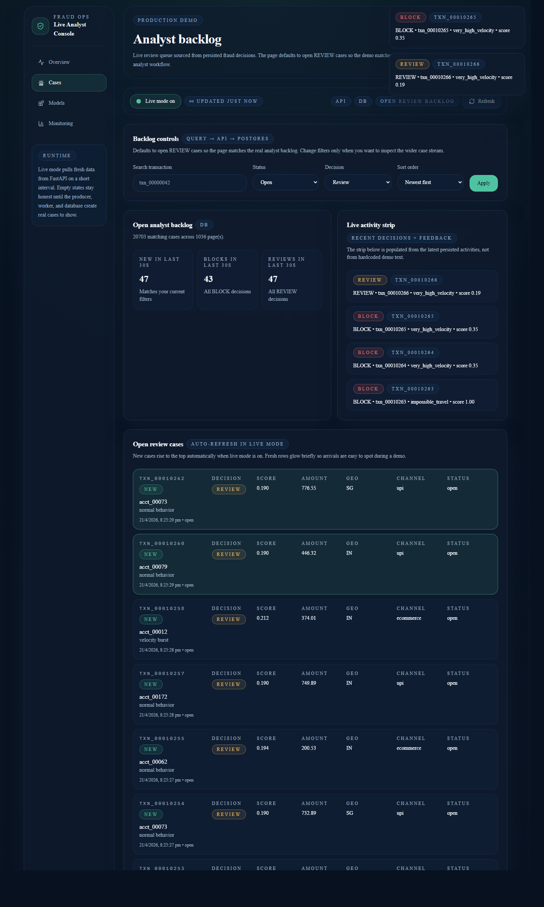
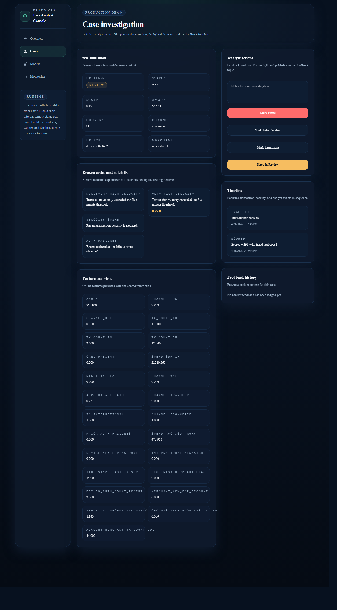
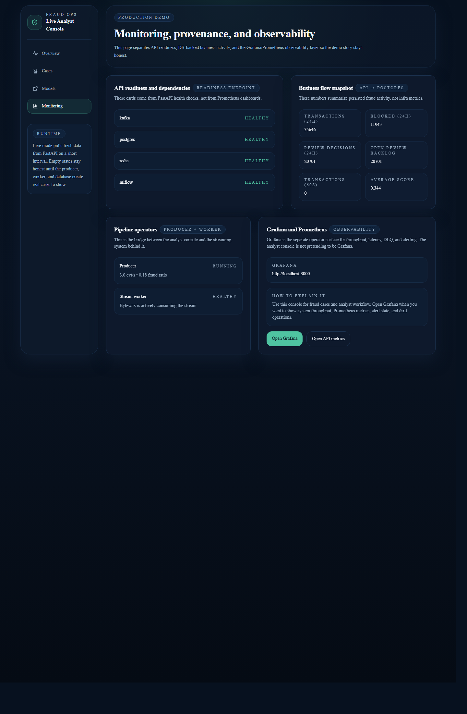
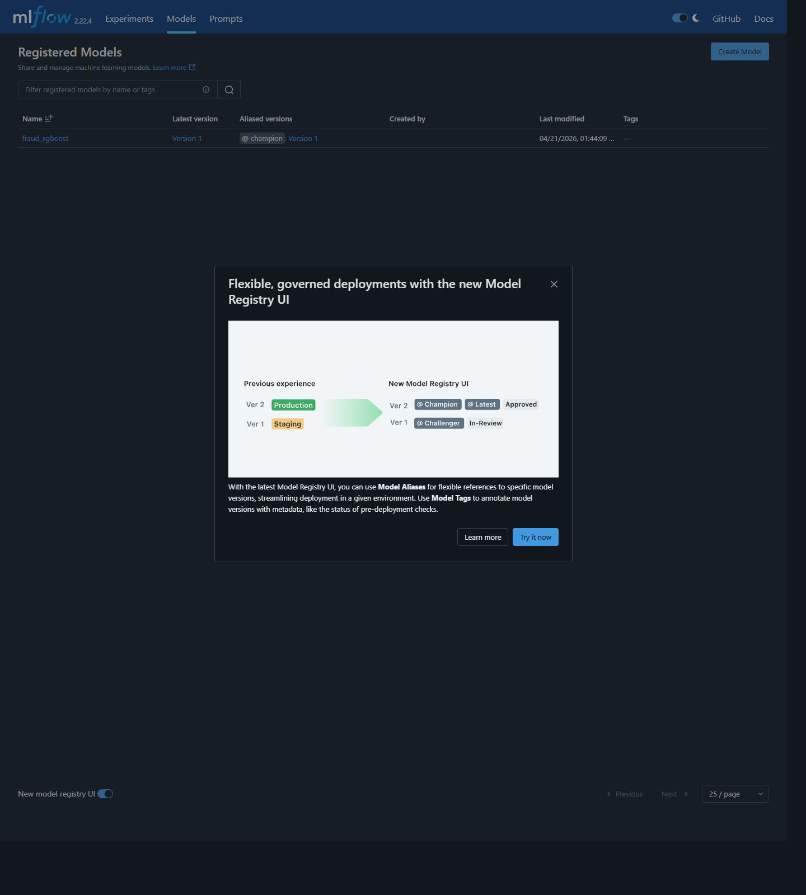

<div align="center">


<p>
  <a href="https://github.com/kulharshit21/bytewatch-fraud-platform"></a>
  <a href="https://github.com/kulharshit21/bytewatch-fraud-platform/commits/main"></a>
  
  
</p>

<p>
  
  
  
  
  
</p>

</div>

# ByteWatch Fraud Platform

Production-minded fraud platform built as a modular monorepo with Kafka ingestion, a Bytewax stream worker, Redis online features, XGBoost plus rules hybrid scoring, FastAPI business APIs, PostgreSQL persistence, MLflow model registry, Evidently drift reporting, Grafana dashboards, and a real Next.js analyst console.

## Problem Statement

Fraud teams need more than an offline classifier. They need a system that can ingest live payment events, maintain rolling behavioral context, combine deterministic controls with ML scoring, surface cases to analysts quickly, and close the loop with feedback, monitoring, and retraining.

## Why This Project Matters

- Most fraud portfolios stop at notebooks and batch metrics.
- Real-world fraud systems are judged on latency, explainability, observability, and analyst workflow.
- This repo focuses on the full product story: streaming ingestion, online features, hybrid decisioning, case review, drift monitoring, and demo-friendly operations tooling.

## Quick Jump

<p>
  <a href="#what-is-real-now"></a>
  <a href="#architecture-summary"></a>
  <a href="#quickstart"></a>
  <a href="#live-demo-capabilities"></a>
  <a href="#screenshots"></a>
</p>

## What Is Real Now

<table>
  <tr>
    <td width="50%" valign="top">
      <h3>Streaming and decisioning</h3>
      <ul>
        <li>Kafka topics are bootstrapped automatically for <code>tx.raw</code>, <code>tx.validated</code>, <code>tx.enriched</code>, <code>tx.scored</code>, <code>tx.decisions</code>, <code>tx.feedback</code>, and <code>tx.dlq</code>.</li>
        <li>The producer generates realistic synthetic transaction behavior and publishes directly to <code>tx.raw</code>.</li>
        <li>The stream worker consumes Kafka with Bytewax, validates events, computes Redis-backed online features, scores with rules plus model runtime, persists to PostgreSQL, and emits downstream topics.</li>
        <li>The overview page includes demo controls that trigger real producer behavior through API-backed control endpoints.</li>
      </ul>
    </td>
    <td width="50%" valign="top">
      <h3>Product and MLOps</h3>
      <ul>
        <li>The trainer can bootstrap a champion XGBoost model, register it in MLflow, and generate Evidently drift artifacts.</li>
        <li>The API exposes real fraud workflows: <code>/predict</code>, <code>/cases</code>, <code>/cases/{id}</code>, feedback submission, model metadata, analytics, and dashboard payloads.</li>
        <li>The analyst console reads live API data. There are no hardcoded queue rows or fake case cards left in the UI.</li>
        <li>Database retraining consumes analyst feedback from <code>analyst_feedback</code> by overriding synthetic labels with the latest analyst decision when available.</li>
      </ul>
    </td>
  </tr>
</table>

## Key Features

- Real-time producer to Kafka to Bytewax to Redis to scoring to Postgres pipeline
- Redis-backed rolling features for velocity, spend, novelty, and geo jumps
- Hybrid decisioning with rules plus champion XGBoost model
- Persisted rule hits, reason codes, scores, and case metadata
- API-driven analyst console with live polling-based updates
- Analyst feedback loop written to both PostgreSQL and `tx.feedback`
- MLflow model registry plus Evidently drift reporting
- Grafana and Prometheus dashboards for throughput, latency, DLQ, and drift

## Architecture Summary



More detail:

- [Architecture overview](docs/architecture/overview.md)
- [Transaction lifecycle](docs/architecture/transaction-lifecycle.md)
- [Runbook](docs/runbook.md)
- [Troubleshooting](docs/troubleshooting.md)
- [Demo script](docs/demo-script.md)
- [Release notes + pinned text](docs/release-notes-v0.1.0.md)
- [GitHub profile kit](docs/github-profile-kit.md)

## Tech Stack

| Layer | Tools |
|---|---|
| Streaming | Kafka, Bytewax |
| Online state | Redis |
| ML and rules | XGBoost, scikit-learn, YAML rule engine |
| APIs | FastAPI, Pydantic v2 |
| Persistence | PostgreSQL, SQLAlchemy, Alembic |
| Analyst UI | Next.js 15, TypeScript, Tailwind, shadcn-style components |
| Observability | Prometheus, Grafana |
| Model Ops | MLflow, Evidently |
| Packaging | Docker Compose, Makefile, GitHub Actions |

## Repository Structure

```text
apps/
  analyst-console/    # Next.js internal operations UI
  api/                # FastAPI business API
  producer/           # synthetic traffic generator + export CLI
  stream-worker/      # Bytewax flow + stream runtime
  trainer/            # XGBoost training, MLflow, Evidently
libs/
  common/             # config, logging, FastAPI service helpers
  contracts/          # shared Pydantic event contracts
  feature_engineering/# online/offline feature computation
  feature_store/      # Redis + in-memory feature store adapters
  model_runtime/      # champion model loading and hybrid scoring
  observability/      # Prometheus metrics
  persistence/        # SQLAlchemy models and repositories
  rules/              # YAML-driven fraud rules
infra/
  docker/             # Dockerfiles
  grafana/            # dashboards + alerts as code
  kafka/              # topic bootstrap
  postgres/           # init SQL + Alembic migrations
  prometheus/
docs/
tests/
```

## Quickstart

### Prerequisites

- Docker Desktop or Docker Engine with Compose
- Node 20+ only if you want to run the analyst console outside Docker
- Python 3.11 for local non-Docker backend development

### One-command local stack

```bash
docker compose up --build
```

The stack includes:

- `kafka`
- `redis`
- `postgres`
- `prometheus`
- `grafana`
- `mlflow`
- `db-migrate`
- `model-bootstrap`
- `producer`
- `stream-worker`
- `api`
- `trainer`
- `analyst-console`

### Clean bootstrap from empty state

Use this when you want a deterministic local reset instead of reusing old Kafka, Redis, PostgreSQL, MLflow, or Grafana state.

```bash
make reset-stack
make bootstrap
```

Equivalent Docker Compose sequence:

```bash
docker compose down --volumes --remove-orphans
docker compose up -d --build
```

### Key URLs

| Surface | URL |
|---|---|
| Analyst console | `http://localhost:3001` |
| Overview live demo | `http://localhost:3001/overview` |
| Analyst backlog live demo | `http://localhost:3001/cases` |
| API docs | `http://localhost:8000/docs` |
| Producer | `http://localhost:8001/producer/status` |
| Stream worker | `http://localhost:8002/worker/status` |
| Trainer | `http://localhost:8003/training/status` |
| Grafana | `http://localhost:3000` |
| Prometheus | `http://localhost:9090` |
| MLflow | `http://localhost:5000` |

## Live Demo Capabilities

### What updates automatically

- `Overview` and `Cases` enable live mode by default.
- Live mode is implemented with real polling-based browser updates, not fake frontend animation.
- Polling hits FastAPI live endpoints:
  - `/dashboard/live`
  - `/cases/live`
- Turning live mode off freezes the current browser snapshot until you click refresh.
- The backlog page defaults to the real analyst queue: `decision=REVIEW` and `status=open`.

### What the analyst console is for

- The analyst console is the fraud operations surface.
- It is where you review cases, inspect scores and reasons, trigger demo bursts, and submit feedback.

### What Grafana is for

- Grafana is the operator and observability surface.
- It is where you show throughput, latency, errors, drift, and alerting.
- The analyst console is intentionally not pretending to be Grafana.

### Demo controls

The overview page includes real producer controls that call API-backed endpoints:

- `POST /demo/producer/start`
- `POST /demo/producer/stop`
- `POST /demo/producer/burst`
- `POST /demo/producer/boost`
- `POST /demo/producer/reset`

These controls change real backend behavior and push new events through Kafka, Bytewax, Redis, scoring, Postgres, and the UI.

## Demo Walkthrough

1. Open `http://localhost:3001/overview`.
2. Point out the live badge, last-updated label, recent-window counters, and activity feed.
3. Trigger `Inject impossible travel burst` or `Inject new-device high-amount burst`.
4. Open `http://localhost:3001/cases` and show new rows rising into the real analyst backlog.
5. Open a case detail page and submit feedback.
6. Open Grafana to show the operational view of the same system.
7. Open MLflow to show the registered champion model.

## Model, Training, and Registry

- The trainer can bootstrap a champion XGBoost model from generated CSV data.
- It can also rebuild training data from persisted PostgreSQL transactions.
- When analyst feedback exists, retraining uses the latest analyst label instead of the synthetic source label.
- MLflow stores registered model versions and aliases like `champion`.
- Evidently generates drift artifacts and updates drift metrics surfaced in Grafana.

## Observability

- Prometheus metrics are exposed by every Python service on `/metrics`.
- Grafana dashboards are provisioned from `infra/grafana/dashboards`.
- Alert rules are provisioned from `infra/grafana/provisioning/alerting`.
- Local alert notifications terminate at the API webhook sink at `POST /ops/grafana-alerts`.
- Drift gauges are updated after the trainer generates a new Evidently report.

## Useful Commands

```bash
docker compose up --build
make reset-stack
make bootstrap
docker compose logs -f stream-worker
docker compose logs -f api
docker compose exec trainer fraud-trainer-cli bootstrap-model --force
docker compose exec trainer python -c "from fraud_platform_common.config import RuntimeSettings; from fraud_platform_persistence import FraudRepository; repo = FraudRepository(RuntimeSettings(service_name='trainer')); rows = repo.training_frame(); print(rows[-1]['label_source'], rows[-1]['latest_feedback_label'])"
docker compose exec trainer fraud-trainer-cli drift-report --sample-size 500
docker compose exec producer fraud-producer-cli export-dataset --output /data/bootstrap_transactions.csv --events 3000
docker compose exec api python -c "import requests; print(requests.get('http://localhost:8000/dashboard/overview').json())"
curl http://localhost:8000/dashboard/live
curl "http://localhost:8000/cases/live?status=open&decision=REVIEW"
curl -X POST http://localhost:8000/demo/producer/burst -H "content-type: application/json" -d "{\"scenario\":\"impossible_travel\",\"count\":10}"
make test-docker
make frontend-test
```

## Screenshots

These screenshots were captured from the running local stack and wired directly into the repo so visitors can see the product story before they clone it.

### Overview live mode

<p align="center">
  
</p>

Live overview with recent-window counters, API-backed live polling, producer controls, and the latest persisted decisions.

### Analyst backlog and investigation flow

<table>
  <tr>
    <td width="50%" valign="top">
      
      <p><strong>Cases backlog.</strong> Open review queue sourced from persisted fraud decisions, with fresh rows highlighted during live mode.</p>
    </td>
    <td width="50%" valign="top">
      
      <p><strong>Case detail.</strong> Transaction context, feature snapshot, rule hits, reason codes, and real analyst feedback actions.</p>
    </td>
  </tr>
</table>

### Monitoring and model operations

<table>
  <tr>
    <td width="50%" valign="top">
      
      <p><strong>Monitoring page.</strong> Separates readiness, DB-backed business counts, and Grafana/Prometheus operator links.</p>
    </td>
    <td width="50%" valign="top">
      
      <p><strong>MLflow registry.</strong> Registered <code>fraud_xgboost</code> model with the <code>champion</code> alias visible in the local MLflow UI.</p>
    </td>
  </tr>
</table>

Grafana remains linked from the monitoring page and README URLs because the local demo stack keeps the operator dashboard behind its own login surface.

See [docs/screenshots-checklist.md](docs/screenshots-checklist.md) for the ordered capture plan and suggested captions.

## Local Development

### Python

```bash
python -m compileall apps libs
pytest
```

Important: this repo targets Python 3.11. Running tests with Python 3.10 will fail because the code intentionally uses Python 3.11 features such as `StrEnum` and `datetime.UTC`.

Reproducible backend test run from Docker:

```bash
make test-docker
```

### Analyst console

```bash
cd apps/analyst-console
npm install
npm run build
npm test
```

## Honest Limitations

- The worker runtime runs Bytewax inside the service process for local simplicity; distributed deployment tuning is still out of scope.
- The current MLflow service uses a local SQLite-backed metadata store suitable for demos, not HA production.
- Feedback-driven retraining is implemented as a controlled and manual workflow, not automatic promotion.
- Local Grafana notifications terminate at the API webhook sink rather than a real on-call channel.
- Kafka lag monitoring is not fully instrumented yet.
- The `Models` page remains snapshot-style; the live polling emphasis is on `Overview` and `Cases`.
- The local host shell often defaults to Python 3.10, so backend commands should be run through Docker or Python 3.11.

## Future Improvements

- Upgrade live polling to SSE or websockets when the product surface needs finer-grained updates
- Add richer backlog triage workflows and analyst assignment states
- Expand Kafka lag and consumer-group observability
- Add a replay mode for controlled historical stream demonstrations
- Add real screenshot assets and an optional short demo GIF

## License

This repository is released under the [MIT License](LICENSE).

<div align="center">


</div>
