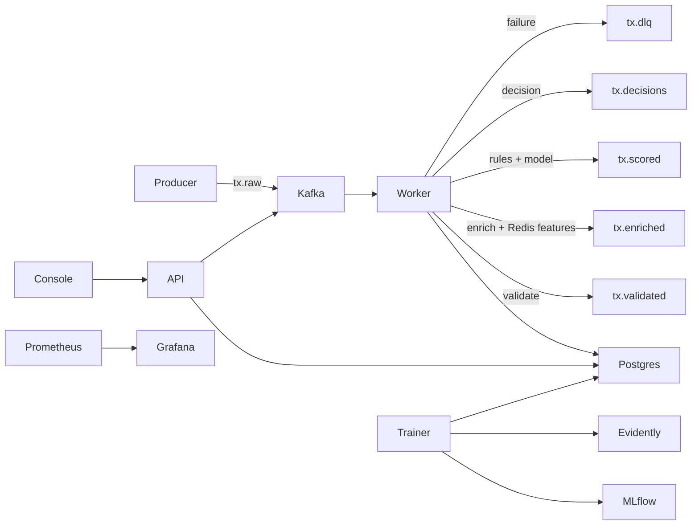
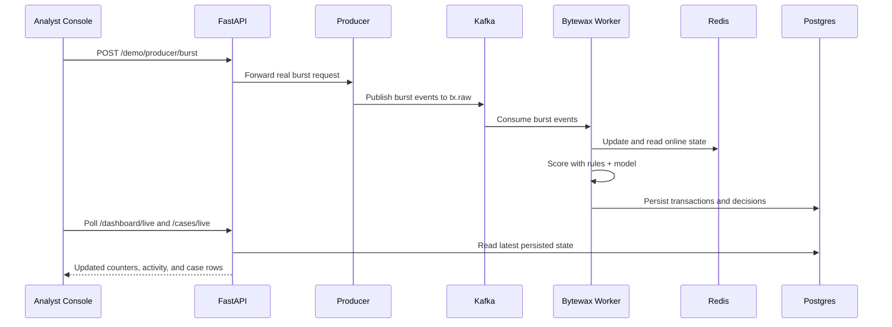

# Platform Overview

This document is the GitHub-reader-friendly summary of how the platform is organized, what each service owns, and what parts of the experience are genuinely live.

## Service Responsibilities

- `apps/producer`: generates realistic synthetic transaction behavior, publishes to Kafka, and exports CSV datasets for training.
- `apps/stream-worker`: runs the Bytewax flow that validates transactions, enriches them with Redis-backed online features, applies rules plus model scoring, writes PostgreSQL records, and emits downstream Kafka topics.
- `apps/api`: exposes prediction, case management, feedback, model metadata, analytics, live dashboard payloads, and producer demo-control endpoints.
- `apps/trainer`: prepares features offline, trains XGBoost, registers models in MLflow, and writes Evidently drift artifacts.
- `apps/analyst-console`: internal operations UI for analysts and demo flows.

## Architecture Summary

## Kafka Topic Design

| Topic | Purpose | Key |
| --- | --- | --- |
| `tx.raw` | Producer output | `account_id` |
| `tx.validated` | Schema-valid normalized transactions | `account_id` |
| `tx.enriched` | Transactions with online features | `account_id` |
| `tx.scored` | Hybrid model plus rule scores | `account_id` |
| `tx.decisions` | Final decision payloads | `account_id` |
| `tx.feedback` | Analyst feedback events | `case_id` |
| `tx.dlq` | Validation or processing failures | `event_id` |

## Redis Key Strategy

- `event:processed:{event_id}`: idempotency claim key
- `acct:{account_id}:tx:zset`: rolling timestamp window for velocity counts
- `acct:{account_id}:spend:zset`: rolling spend window
- `acct:{account_id}:devices:set`: known devices
- `acct:{account_id}:merchants:set`: known merchants
- `acct:{account_id}:merchant:{merchant_id}:count`: account-merchant frequency
- `acct:{account_id}:failed_auth:zset`: recent auth failures
- `acct:{account_id}:profile:hash`: last seen location and long-lived account profile
- `risk:merchants:high:set`: merchant risk flags

## PostgreSQL Tables

- `transactions_raw`: raw payload snapshots keyed by event, transaction, and account
- `transactions_scored`: features, rule hits, reason codes, score, and decision metadata
- `fraud_decisions`: case-level decision records
- `analyst_feedback`: human feedback for model review and retraining
- `model_registry_cache`: local model metadata snapshot
- `audit_logs`: operator traceability

## How The Real-Time Flow Works

1. The producer publishes `TransactionEvent` payloads into `tx.raw`.
2. Bytewax consumes those events, validates them, and emits `tx.validated`.
3. The worker reads Redis state to compute rolling counts, novelty, spend, geo, and auth features, then emits `tx.enriched`.
4. Rules and the champion XGBoost model combine into a final decisioning step, which emits `tx.scored` and `tx.decisions`.
5. The worker persists raw, scored, and case-level decision records to PostgreSQL.
6. FastAPI reads those persisted records to power the analyst console, `/predict`, analytics endpoints, and feedback workflows.
7. The browser live experience is driven by real polling against FastAPI live endpoints, not by fake animation or hardcoded counters.

## What Happens When You Click A Demo Burst

The important point: the button is only a trigger. The visible UI change comes from the real backend pipeline producing new persisted outcomes.

## What Is Live Versus Snapshot

### Live surfaces

- `Overview`: real polling-based updates from `/dashboard/live`
- `Cases`: real polling-based updates from `/cases/live`
- Activity feed and recent-window counters: derived from real API deltas and persisted DB state

### Snapshot-oriented surfaces

- Individual case detail pages
- Models page
- Most static explanatory text and architecture docs

### Separate but related surfaces

- Analyst console: fraud operations and demo workflow
- Grafana: operator and observability surface for throughput, latency, errors, DLQ, and drift

## API Surface

- `GET /health/live`
- `GET /health/ready`
- `GET /metrics`
- `POST /predict`
- `GET /transactions/{transaction_id}`
- `GET /cases`
- `GET /cases/live`
- `GET /cases/{case_id}`
- `POST /cases/{case_id}/feedback`
- `GET /models/current`
- `POST /models/reload`
- `GET /analytics/summary`
- `GET /analytics/trends`
- `GET /dashboard/overview`
- `GET /dashboard/live`
- `POST /demo/producer/start`
- `POST /demo/producer/stop`
- `POST /demo/producer/burst`
- `POST /demo/producer/boost`
- `POST /demo/producer/reset`

## Operator Dashboards

- Fraud overview: throughput and decision pressure
- Model performance: prediction mix, model latency, active model metadata
- System health: API errors, worker latency, Redis latency, DLQ rate
- Drift monitoring: latest drift score and drift trend
