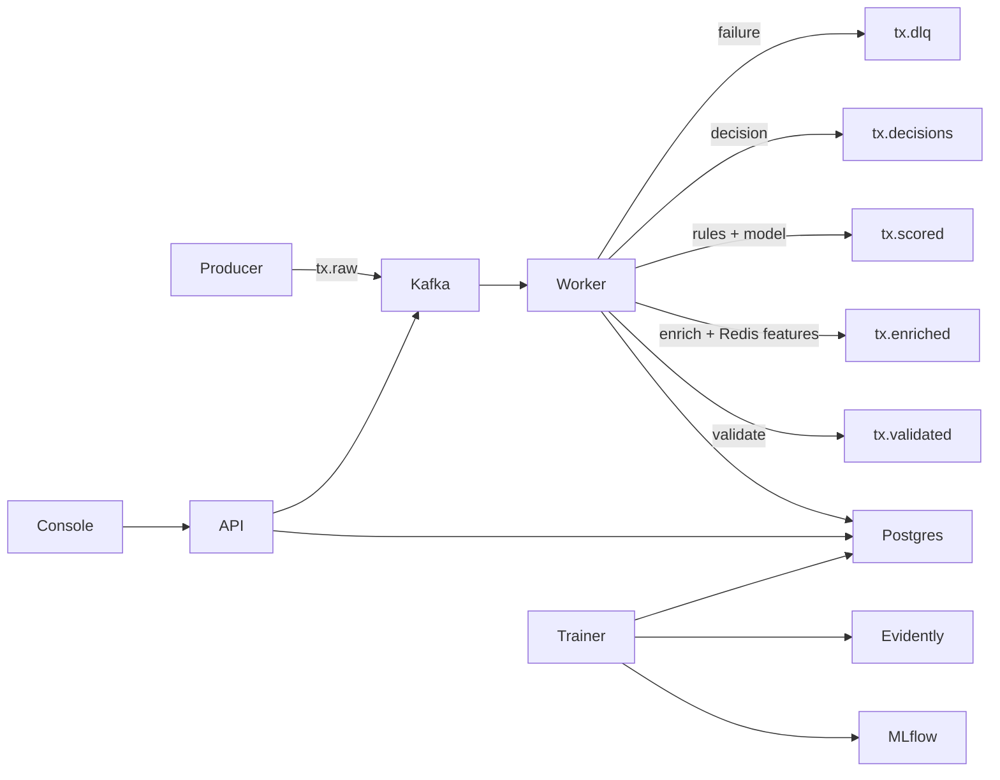

# Platform Overview

## Service Responsibilities

- `apps/producer`: generates realistic synthetic transaction behavior, publishes to Kafka, and exports CSV datasets for training.
- `apps/stream-worker`: runs the Bytewax flow that validates transactions, enriches them with Redis-backed online features, applies rules + model scoring, writes PostgreSQL records, and emits downstream Kafka topics.
- `apps/api`: exposes prediction, case management, feedback, model metadata, and analytics endpoints.
- `apps/trainer`: prepares features offline, trains XGBoost, registers models in MLflow, and writes Evidently drift artifacts.
- `apps/analyst-console`: internal operations UI for analysts and demo flows.

## Kafka Topic Design

| Topic | Purpose | Key |
| --- | --- | --- |
| `tx.raw` | Producer output | `account_id` |
| `tx.validated` | Schema-valid normalized transactions | `account_id` |
| `tx.enriched` | Transactions with online features | `account_id` |
| `tx.scored` | Hybrid model + rule scores | `account_id` |
| `tx.decisions` | Final decision payloads | `account_id` |
| `tx.feedback` | Analyst feedback events | `case_id` |
| `tx.dlq` | Validation / processing failures | `event_id` |

## Redis Key Strategy

- `event:processed:{event_id}`: idempotency claim key
- `acct:{account_id}:tx:zset`: rolling timestamp window for velocity counts
- `acct:{account_id}:spend:zset`: rolling spend window
- `acct:{account_id}:devices:set`: known devices
- `acct:{account_id}:merchants:set`: known merchants
- `acct:{account_id}:merchant:{merchant_id}:count`: account-merchant frequency
- `acct:{account_id}:failed_auth:zset`: recent auth failures
- `acct:{account_id}:profile:hash`: last seen location and long-lived account profile
- `risk:merchants:high:set`: merchant risk flags

## PostgreSQL Tables

- `transactions_raw`: raw payload snapshots keyed by event/transaction/account
- `transactions_scored`: features, rule hits, reason codes, score, and decision metadata
- `fraud_decisions`: case-level decision records
- `analyst_feedback`: human feedback for model review and retraining
- `model_registry_cache`: local model metadata snapshot
- `audit_logs`: operator traceability

## End-to-End Lifecycle

## API Surface

- `GET /health/live`
- `GET /health/ready`
- `GET /metrics`
- `POST /predict`
- `GET /transactions/{transaction_id}`
- `GET /cases`
- `GET /cases/{case_id}`
- `POST /cases/{case_id}/feedback`
- `GET /models/current`
- `POST /models/reload`
- `GET /analytics/summary`
- `GET /analytics/trends`
- `GET /dashboard/overview`

## Operator Dashboards

- Fraud overview: throughput and decision pressure
- Model performance: prediction mix, model latency, active model metadata
- System health: API errors, worker latency, Redis latency, DLQ rate
- Drift monitoring: latest drift score and drift trend
