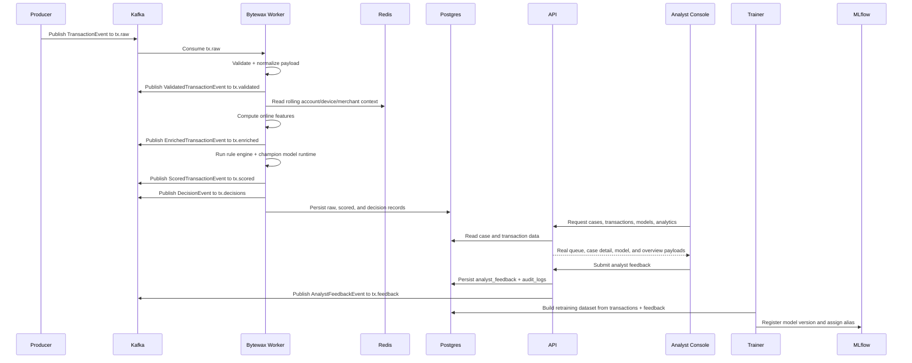

# Transaction Lifecycle

This document walks through the path a single transaction takes through the platform and explains the related feedback and retraining loop.

## End-to-End Sequence

## Step Breakdown

1. The producer creates a realistic transaction event with scenario metadata.
2. Kafka receives the event on `tx.raw`.
3. Bytewax validates and normalizes the payload.
4. Redis provides hot context for velocity, spend, novelty, geo, and failed-auth features.
5. The worker creates an enriched feature vector.
6. Rules and the champion model produce score, reason codes, and decision state.
7. The worker writes all important state to PostgreSQL.
8. FastAPI exposes that persisted state to the analyst console and external demo endpoints.
9. Analysts review cases and submit feedback.
10. Trainer workflows can use that feedback as the latest ground-truth label for retraining.

## DLQ Behavior

- Schema failures are wrapped in `DeadLetterEvent` and written to `tx.dlq`.
- Processing failures during feature enrichment or scoring are also written to `tx.dlq`.
- DLQ volume is emitted as a Prometheus counter and surfaced in Grafana.

## Retraining Behavior

- The trainer can bootstrap a champion model from generated CSV data.
- It can also rebuild training data from persisted PostgreSQL transactions that include labels.
- When analyst feedback exists, the trainer uses the analyst label instead of the synthetic `label` field from the raw event payload.
- Promotion remains controlled: alias assignment is explicit and lives in MLflow.

## Demo Burst Lifecycle

When you click a burst control in the UI:

1. The analyst console calls a real FastAPI endpoint under `/demo/producer/*`.
2. FastAPI forwards the request to the producer service.
3. The producer injects a real scenario burst into Kafka.
4. The worker processes those events like any other traffic.
5. The resulting cases appear in the overview and backlog because the browser polls real live endpoints.

## Live Data Versus Static Text

### Live data

- Recent activity feed
- Recent-window counters
- Backlog row arrivals
- Producer and worker status cards

### Snapshot data

- Architecture text
- Troubleshooting guides
- Most case detail views after initial load
- Models page between refreshes
