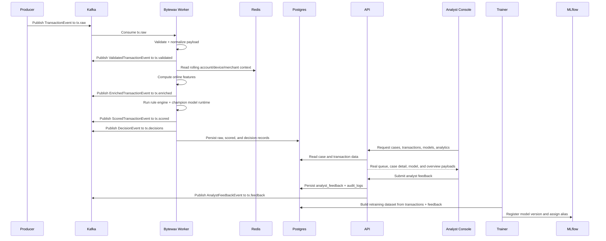

# Transaction Lifecycle

## DLQ Behavior

- Schema failures are wrapped in `DeadLetterEvent` and written to `tx.dlq`.
- Processing failures during feature enrichment or scoring are also written to `tx.dlq`.
- DLQ volume is emitted as a Prometheus counter and surfaced in Grafana.

## Retraining Behavior

- The trainer can bootstrap a champion model from generated CSV data.
- It can also rebuild training data from persisted PostgreSQL transactions that include labels.
- Promotion remains controlled: alias assignment is explicit and lives in MLflow.
